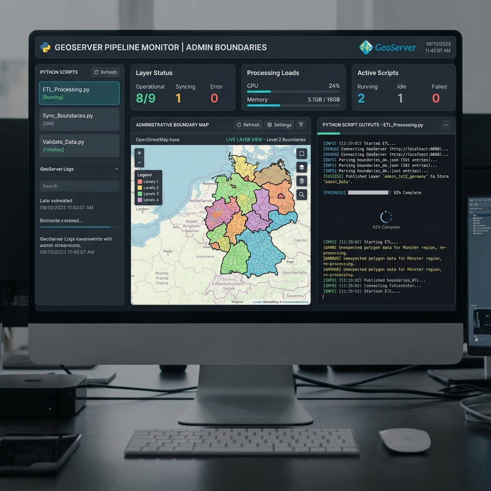

## UI / UX Mockup



# Satu Peta — GeoServer Upload Scripts

Python automation scripts for uploading GIS shapefiles (Batas Kecamatan & Jaringan Jalan) and SLD styles to a GeoServer instance, then publishing them as WMS/WFS layers.

> **Project**: Satu Peta — Kota Tasikmalaya  
> **Target GeoServer**: `geoserver.tasikmalayakota.go.id`  
> **Workspace**: `putr`

---

## ⚠️ Security Notice

Some scripts contain **hardcoded credentials**. Before sharing or deploying, replace them with environment variables or a `.env` file.

---

## Python Scripts

### 1. `upload_to_geoserver.py` — Full Pipeline (Recommended)

The main end-to-end script. Uploads shapefiles, converts & uploads SLD styles, applies styles to layers, creates a Layer Group, and verifies WMS/WFS capabilities.

**Features:**
- In-memory shapefile ZIP creation
- SLD 1.1.0 → 1.0.0 auto-conversion for GeoServer compatibility
- Workspace-scoped and global style fallback
- Bounding box merging for Layer Group
- WMS & WFS verification

```bash
python upload_to_geoserver.py
```

---

### 2. `upload_final.py` — REST API with CSRF Bypass

Uploads shapefiles and SLD styles via the GeoServer REST API using HTTP `Referer`/`Origin` headers to bypass CSRF protection.

**Features:**
- CSRF bypass via `Referer` and `Origin` headers
- Shapefile ZIP upload (PUT)
- SLD style upload (POST + PUT)
- Layer Group creation
- WMS verification

```bash
python upload_final.py
```

---

### 3. `upload_v3.py` — Session Login + REST API

Uses HTTPS session with form-based login to obtain a CSRF token, then performs REST API operations.

**Features:**
- Extracts CSRF token from login page
- Form-based `j_spring_security_check` login
- Multiple header combinations for CSRF bypass
- Full upload pipeline (shapefiles, styles, layer group)

```bash
python upload_v3.py
```

---

### 4. `upload_session.py` — Session-Based Upload with Cookie Handling

Similar session approach with additional fallback strategies (HTTP vs HTTPS, form-based login retry).

**Features:**
- CSRF token extraction from cookies and page content
- `X-Requested-With: XMLHttpRequest` header strategy
- Form-based login fallback

```bash
python upload_session.py
```

---

### 5. `upload_ssh.py` — SSH/SCP Upload

Uploads files via SFTP to the server, then configures GeoServer using `curl` from localhost (bypassing CSRF entirely).

**Features:**
- SSH/SFTP file transfer via `paramiko`
- Auto-detection of GeoServer data directory
- Docker container support
- REST API via localhost (no CSRF issues)

**Requirements:**
```bash
pip install paramiko
```

```bash
python upload_ssh.py
```

---

### 6. `convert_sld.py` — SLD Format Converter

Converts SLD 1.1.0 (with `se:` namespace) to SLD 1.0.0 format compatible with GeoServer.

**Conversions applied:**
- `se:` namespace prefix removal
- `SvgParameter` → `CssParameter`
- `ogc:Literal` unwrapping in `<Gap>` elements
- `<GeneralizeLine>` removal

```bash
python convert_sld.py
```

---

### 7. `create_zips.py` — Shapefile ZIP Creator

Packages shapefile components (`.shp`, `.shx`, `.dbf`, `.prj`, `.cpg`) into ZIP archives for upload.

```bash
python create_zips.py
```

---

### 8. `Batas Administrasi/style_kecamatan_BIG.py` — SLD Style Generator

Generates district boundary SLD styling rules programmatically.

---

### 9. `Jaringan Jalan/` — Road Network Scripts

| Script | Purpose |
|--------|---------|
| `clip_roads.py` | Clips road geometries to district boundaries |
| `apply_style.py` | Applies road styling |
| `check_dbf.py` | Inspects DBF attribute structure |
| `dbf.py` | DBF file manipulation utilities |
| `delete_rencana.py` | Removes planned road features |
| `read_vals.py` | Reads attribute values from shapefiles |

---

### 10. `spatial_utilization_conformity_2024.py` — Spatial Conformity Mapping

Performs spatial utilization conformity analysis for Kota Tasikmalaya. It intersects land use data with RTRW spatial plans and district boundaries, classifies adherence as 'Sesuai' or 'Tidak Sesuai', recalculates areas, and generates a final shapefile with a CSV summary table.

```bash
& "C:\Program Files\QGIS 3.44.7\bin\python-qgis.bat" spatial_utilization_conformity_2024.py
```

---

### 11. `process_shapefiles.py` — Merged Suitability Geoprocessing

Iteratively intersects Land Use (`PENGGUNAAN_LAHAN.shp`), RDTR (`Polaruang_Tasikmalaya.shp`), RTRW, and Kecamatan shapefiles to generate a fully merged suitability shapefile (`Tasikmalaya_Merged_Suitability.shp`) with proper coordinate reference system harmonization and area recalculation.

```bash
python process_shapefiles.py
```

---

### 12. `add_summary_attributes.py` — QGIS Summary Attributes

**For use inside the QGIS Python Console.** Adds city-wide and per-kecamatan area and percentage summary attributes directly into the attribute table of the Conformity layer (`C_Ses_Ha`, `C_Tdk_Ha`, etc.). Useful for dynamic styling and dashboarding in QGIS.

---

## GIS Data

| Layer | Format | CRS | Description |
|-------|--------|-----|-------------|
| `Batas_Kecamatan` | Shapefile | EPSG:32749 (UTM 49S) | District boundaries of Kota Tasikmalaya |
| `jaringan-jalan` | Shapefile | EPSG:32749 (UTM 49S) | Road network of Kota Tasikmalaya |

### SLD Styles
- `batas_kecamatan_style.sld` — Colored polygons with district labels
- `jaringan_jalan_style.sld` — Road classification styling

---

## Layer Group

The scripts create a **Layer Group** named `peta_satu_peta` combining both layers:
- Batas Kecamatan (bottom layer)
- Jaringan Jalan (top layer)

**WMS Endpoint:**
```
http://geoserver.tasikmalayakota.go.id/geoserver/putr/wms
```

---

## Requirements

```
requests
paramiko  # only for upload_ssh.py
```

---

## License

Internal use — Kota Tasikmalaya GIS Infrastructure.
